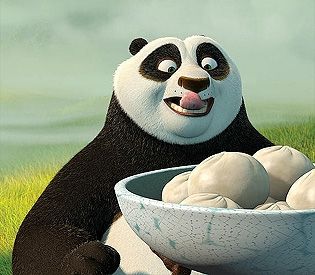

# Albert Ding

> "Your mind is like this water, my friend. When it is agitated, it becomes difficult to see. But if you allow it to settle, the answer becomes clear." - Master Oogway

**Why do I want to be a software engineer?**

I enjoy the math behind programming and thinking up algorithms. 

**What was my first ever program?**

`System.out.println("Hello World!")`

**What is my favorite thing to do when I am bored?**

Watch [Youtube](https://www.youtube.com/). 

**Want to learn more about me?**

[Albert Ding](#Albert-Ding)

**Checkout my CSE110 README file!**
[README file](po.png)
